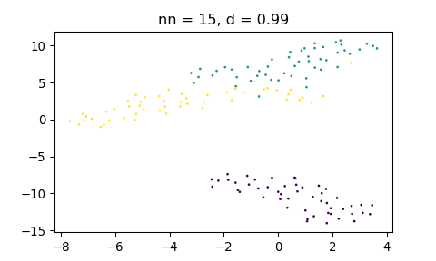
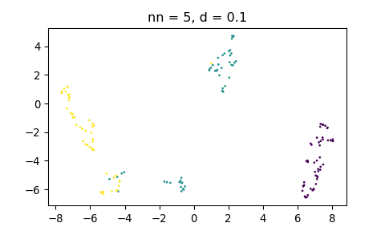

UMAP
================
Lorenzo
5/5/2019

  - [Setup](#setup)
  - [R](#r)
      - [Sweep on `min_dist`](#sweep-on-min_dist)
          - [Naive](#naive)
          - [Using Python backend](#using-python-backend)
      - [Sweep on `n_neighbors`](#sweep-on-n_neighbors)
          - [Naive](#naive-1)
          - [Using Python backend](#using-python-backend-1)
  - [Python](#python)
      - [Sweep on `min_dist`](#sweep-on-min_dist-1)
      - [Sweep on `n_neighbors`](#sweep-on-n_neighbors-1)
      - [Python information](#python-information)
      - [R information](#r-information)

## Setup

``` r
suppressPackageStartupMessages(library(tidyverse))

# Setup Python to use umap conda environment
library(reticulate)
reticulate::use_condaenv('umap', required = TRUE)
```

## R

``` r
# Load UMAP
library(umap)

# Prepare data
iris_mtx <- iris[, c(1:4)]
```

``` r
# Perform UMAP and plot
draw_umap <- function(data_mtx, labels, method = '', n_neighbors = 15, min_dist = 0.1) {
      
   umap_config <- umap.defaults
   umap_config$n_neighbors <- n_neighbors
   umap_config$min_dist <- min_dist
      
   u <- umap(data_mtx, 
             method = method, 
             min_dist = min_dist, 
             n_neighbors = n_neighbors, 
             random_state=42)
   
   # Create data.frame with UMAP coordinates
   df_umap <- as.data.frame(u$layout)
   colnames(df_umap) <- c('x_umap', 'y_umap')
   df_umap <- cbind(df_umap, labels = factor(labels))
   
   p <- ggplot(df_umap, aes(x_umap, y_umap)) +
      geom_point(aes(col = labels)) +
      labs(title = glue::glue('Method: {method}, n_neighbors: {n_neighbors}, min_dist: {min_dist}'))
   
   list(p = p, df = df_umap, u = u)
}
```

### Sweep on `min_dist`

#### Naive

``` r
u <- umap(iris_mtx, method="naive", min_dist = 0.001)
head(u$layout)
##          [,1]       [,2]
## [1,] 12.23124 -0.3331542
## [2,] 10.70993 -1.3126603
## [3,] 10.56486 -0.7540255
## [4,] 10.52019 -0.6786672
## [5,] 12.34705 -0.5749329
## [6,] 13.28508 -0.5979149

u <- umap(iris_mtx, method="naive", min_dist = 0.1)
head(u$layout)
##          [,1]       [,2]
## [1,] 7.672398  0.7412341
## [2,] 8.689200  2.4588411
## [3,] 9.205215  2.0966858
## [4,] 9.309127  2.0443477
## [5,] 7.600816  0.5568721
## [6,] 8.009618 -0.3382019

u <- umap(iris_mtx, method="naive", min_dist = 0.99)
head(u$layout)
##          [,1]      [,2]
## [1,] 15.72760 -6.823932
## [2,] 12.87749 -3.536282
## [3,] 12.29146 -5.260016
## [4,] 11.70992 -5.043886
## [5,] 14.76432 -7.472575
## [6,] 15.86100 -9.229200
```

<!-- --><!-- --><!-- -->

#### Using Python backend

Embeddings do not change:

``` r
u <- umap(iris_mtx, method="umap-learn", min_dist = 0.001)
head(u$layout)
##          [,1]      [,2]
## [1,] 6.003870  1.324167
## [2,] 5.178583 -1.335126
## [3,] 5.838859 -1.043555
## [4,] 5.925804 -1.367196
## [5,] 6.652371  1.206479
## [6,] 6.416837  2.649150

u <- umap(iris_mtx, method="umap-learn", min_dist = 0.1)
head(u$layout)
##          [,1]      [,2]
## [1,] 6.003870  1.324167
## [2,] 5.178583 -1.335126
## [3,] 5.838859 -1.043555
## [4,] 5.925804 -1.367196
## [5,] 6.652371  1.206479
## [6,] 6.416837  2.649150

u <- umap(iris_mtx, method="umap-learn", min_dist = 0.99)
head(u$layout)
##          [,1]      [,2]
## [1,] 6.003870  1.324167
## [2,] 5.178583 -1.335126
## [3,] 5.838859 -1.043555
## [4,] 5.925804 -1.367196
## [5,] 6.652371  1.206479
## [6,] 6.416837  2.649150
```

<!-- --><!-- --><!-- -->

Yet `min_dist` is correctly passed to `umap-learn`:

``` r
u$UMAP
## UMAP(a=True, angular_rp_forest=False, b=True, init='spectral',
##    learning_rate=1.0, local_connectivity=1.0, metric='euclidean',
##    metric_kwds=None, min_dist=0.99, n_components=2, n_epochs=200,
##    n_neighbors=15, negative_sample_rate=5, random_state=805123336,
##    repulsion_strength=1.0, set_op_mix_ratio=1.0, spread=1.0,
##    target_metric='categorical', target_metric_kwds=None,
##    target_n_neighbors=-1, target_weight=0.5, transform_queue_size=4.0,
##    transform_seed=42, verbose=0.0)
u$config$umap_learn_args
##  [1] "n_neighbors"          "n_components"         "metric"              
##  [4] "n_epochs"             "init"                 "min_dist"            
##  [7] "spread"               "set_op_mix_ratio"     "local_connectivity"  
## [10] "negative_sample_rate" "a"                    "b"                   
## [13] "random_state"         "verbose"
```

### Sweep on `n_neighbors`

#### Naive

``` r
u <- umap(iris_mtx, method="naive", n_neighbors = 3)
## Warning: failed creating initial embedding; using random embedding insteadx
head(u$layout)
##          [,1]      [,2]
## [1,] 14.90616 -2.606132
## [2,] 12.09402  0.754079
## [3,] 10.88311  2.152049
## [4,] 11.05938  1.891364
## [5,] 14.99472 -2.536860
## [6,] 13.67929 -3.709823
u <- umap(iris_mtx, method="naive", n_neighbors = 5)
head(u$layout)
##          [,1]       [,2]
## [1,] 17.21133 -0.3841951
## [2,] 13.58648  2.2131810
## [3,] 15.42747  0.7735690
## [4,] 15.21598  1.1838502
## [5,] 16.99997 -0.5407703
## [6,] 18.11772 -1.8737140
u <- umap(iris_mtx, method="naive", n_neighbors = 30)
head(u$layout)
##            [,1]     [,2]
## [1,] 1.87620769 10.23501
## [2,] 0.47491206 11.17115
## [3,] 0.25068178 10.56489
## [4,] 0.07403647 10.83421
## [5,] 1.67211635 10.44052
## [6,] 2.57906196 10.67320
```

    ## Warning: failed creating initial embedding; using random embedding insteadx

<!-- --><!-- --><!-- -->

#### Using Python backend

Results are sensitive on `n_neighbors`:

``` r
u <- umap(iris_mtx, method="umap-learn", n_neighbors = 3)
head(u$layout)
##          [,1]     [,2]
## [1,] 5.807310 5.037849
## [2,] 5.161141 7.221533
## [3,] 8.344112 2.859802
## [4,] 8.429193 2.616889
## [5,] 6.159882 5.051479
## [6,] 3.812690 3.147356
u <- umap(iris_mtx, method="umap-learn", n_neighbors = 5)
head(u$layout)
##           [,1]       [,2]
## [1,]  9.696502  1.2050042
## [2,]  8.390391  4.7996664
## [3,]  7.742820  3.0380390
## [4,]  7.626956  3.5078447
## [5,] 10.250016  1.2330544
## [6,] 10.622615 -0.6588516
u <- umap(iris_mtx, method="umap-learn", n_neighbors = 30)
head(u$layout)
##          [,1]      [,2]
## [1,] 8.543049 -2.910917
## [2,] 9.978408 -4.501753
## [3,] 9.569179 -4.663228
## [4,] 9.709599 -4.946994
## [5,] 8.324167 -3.412310
## [6,] 7.398268 -2.479999
```

<!-- --><!-- --><!-- -->

`UMAP` object is updated:

``` r
u$UMAP
## UMAP(a=True, angular_rp_forest=False, b=True, init='spectral',
##    learning_rate=1.0, local_connectivity=1.0, metric='euclidean',
##    metric_kwds=None, min_dist=0.1, n_components=2, n_epochs=200,
##    n_neighbors=30, negative_sample_rate=5, random_state=805123336,
##    repulsion_strength=1.0, set_op_mix_ratio=1.0, spread=1.0,
##    target_metric='categorical', target_metric_kwds=None,
##    target_n_neighbors=-1, target_weight=0.5, transform_queue_size=4.0,
##    transform_seed=42, verbose=0.0)
u$config$umap_learn_args
##  [1] "n_neighbors"          "n_components"         "metric"              
##  [4] "n_epochs"             "init"                 "min_dist"            
##  [7] "spread"               "set_op_mix_ratio"     "local_connectivity"  
## [10] "negative_sample_rate" "a"                    "b"                   
## [13] "random_state"         "verbose"
```

## Python

Calling from a `reticulate` session: no problems.

``` python
import numpy as np
from sklearn.datasets import load_iris
import matplotlib.pyplot as plt
import umap

# Prepare data
iris = load_iris()

def draw_umap(data, labels, n_neighbors=15, min_dist=0.1, title='', close=True):
   fit = umap.UMAP(
      n_neighbors=n_neighbors,
      min_dist=min_dist,
      n_components=2
   )
   
   u = fit.fit_transform(data);
   
   if (close):
      plt.close('all')
   plt.scatter(u[:,0], u[:,1], c=labels, s=1)
   plt.title('nn = {}, d = {}'.format(n_neighbors, min_dist))
   plt.show()
```

### Sweep on `min_dist`

``` python
draw_umap(iris.data, iris.target, min_dist=0.001)
## C:\ANACON~1\envs\umap\lib\site-packages\umap\spectral.py:229: UserWarning: Embedding a total of 2 separate connected components using meta-embedding (experimental)
##   n_components
```

<!-- -->

``` python
draw_umap(iris.data, iris.target, min_dist=0.1)
## C:\ANACON~1\envs\umap\lib\site-packages\umap\spectral.py:229: UserWarning: Embedding a total of 2 separate connected components using meta-embedding (experimental)
##   n_components
```

<!-- -->

``` python
draw_umap(iris.data, iris.target, min_dist=0.99)
## C:\ANACON~1\envs\umap\lib\site-packages\umap\spectral.py:229: UserWarning: Embedding a total of 2 separate connected components using meta-embedding (experimental)
##   n_components
```

<!-- -->

### Sweep on `n_neighbors`

``` python
draw_umap(iris.data, iris.target, n_neighbors=3)
## C:\ANACON~1\envs\umap\lib\site-packages\umap\spectral.py:229: UserWarning: Embedding a total of 4 separate connected components using meta-embedding (experimental)
##   n_components
```

<!-- -->

``` python
draw_umap(iris.data, iris.target, n_neighbors=5)
## C:\ANACON~1\envs\umap\lib\site-packages\umap\spectral.py:229: UserWarning: Embedding a total of 2 separate connected components using meta-embedding (experimental)
##   n_components
```

<!-- -->

``` python
draw_umap(iris.data, iris.target, n_neighbors=30)
```

<!-- -->

### Python information

    ## {'commit_hash': '8c47bbcb3',
    ##  'commit_source': 'installation',
    ##  'default_encoding': 'cp1252',
    ##  'ipython_path': 'C:\\ANACON~1\\envs\\umap\\lib\\site-packages\\IPython',
    ##  'ipython_version': '7.5.0',
    ##  'os_name': 'nt',
    ##  'platform': 'Windows-10-10.0.18362-SP0',
    ##  'sys_executable': 'C:\\R\\R-35~1.3\\bin\\x64\\Rterm.exe',
    ##  'sys_platform': 'win32',
    ##  'sys_version': '3.6.7 (default, Feb 28 2019, 07:28:18) [MSC v.1900 64 bit '
    ##                 '(AMD64)]'}

Packages in current environment:

``` python
import subprocess

result = subprocess.run(['pip', 'list'], 
   stdout=subprocess.PIPE, 
   stderr=subprocess.PIPE, 
   stdin=subprocess.PIPE, 
   shell=True)
   
print(result.stdout.decode())
```

``` 
## Package          Version 
## ---------------- --------
## backcall         0.1.0   
## certifi          2019.3.9
## colorama         0.4.1   
## cycler           0.10.0  
## decorator        4.4.0   
## ipython          7.5.0   
## ipython-genutils 0.2.0   
## jedi             0.13.3  
## kiwisolver       1.1.0   
## llvmlite         0.24.0  
## matplotlib       3.0.3   
## numba            0.39.0  
## numpy            1.16.3  
## pandas           0.24.2  
## parso            0.4.0   
## patsy            0.5.1   
## pickleshare      0.7.5   
## pip              19.1    
## prompt-toolkit   2.0.9   
## Pygments         2.3.1   
## pyparsing        2.4.0   
## python-dateutil  2.8.0   
## pytz             2019.1  
## scikit-learn     0.20.3  
## scipy            1.2.1   
## seaborn          0.9.0   
## setuptools       41.0.1  
## six              1.12.0  
## statsmodels      0.9.0   
## tornado          6.0.2   
## traitlets        4.3.2   
## umap-learn       0.3.8   
## wcwidth          0.1.7   
## wheel            0.33.1  
## wincertstore     0.2     
```

### R information

``` r
sessionInfo()
## R version 3.5.3 (2019-03-11)
## Platform: x86_64-w64-mingw32/x64 (64-bit)
## Running under: Windows 10 x64 (build 18362)
## 
## Matrix products: default
## 
## locale:
## [1] LC_COLLATE=Italian_Italy.1252  LC_CTYPE=Italian_Italy.1252   
## [3] LC_MONETARY=Italian_Italy.1252 LC_NUMERIC=C                  
## [5] LC_TIME=Italian_Italy.1252    
## 
## attached base packages:
## [1] stats     graphics  grDevices utils     datasets  methods   base     
## 
## other attached packages:
##  [1] umap_0.2.1.0    reticulate_1.12 forcats_0.4.0   stringr_1.4.0  
##  [5] dplyr_0.8.0.1   purrr_0.3.2     readr_1.3.1     tidyr_0.8.3    
##  [9] tibble_2.1.1    ggplot2_3.1.1   tidyverse_1.2.1
## 
## loaded via a namespace (and not attached):
##  [1] tidyselect_0.2.5 xfun_0.6         haven_2.1.0      lattice_0.20-38 
##  [5] colorspace_1.4-1 generics_0.0.2   htmltools_0.3.6  yaml_2.2.0      
##  [9] rlang_0.3.4      pillar_1.3.1     glue_1.3.1       withr_2.1.2     
## [13] modelr_0.1.4     readxl_1.3.1     plyr_1.8.4       munsell_0.5.0   
## [17] gtable_0.3.0     cellranger_1.1.0 rvest_0.3.3      evaluate_0.13   
## [21] labeling_0.3     knitr_1.22       broom_0.5.2      Rcpp_1.0.1      
## [25] scales_1.0.0     backports_1.1.4  jsonlite_1.6     RSpectra_0.14-0 
## [29] hms_0.4.2        png_0.1-7        digest_0.6.18    stringi_1.4.3   
## [33] grid_3.5.3       cli_1.1.0        tools_3.5.3      magrittr_1.5    
## [37] lazyeval_0.2.2   crayon_1.3.4     pkgconfig_2.0.2  Matrix_1.2-17   
## [41] xml2_1.2.0       lubridate_1.7.4  assertthat_0.2.1 rmarkdown_1.12  
## [45] httr_1.4.0       rstudioapi_0.10  R6_2.4.0         nlme_3.1-137    
## [49] compiler_3.5.3
```
