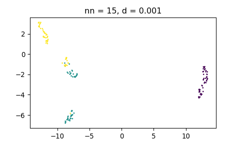

UMAP
================
Lorenzo
5/5/2019

  - [Setup](#setup)
  - [R](#r)
      - [Sweep on `min_dist`](#sweep-on-min_dist)
          - [Naive](#naive)
          - [Using Python backend](#using-python-backend)
      - [Sweep on `n_neighbors`](#sweep-on-n_neighbors)
          - [Naive](#naive-1)
          - [Using Python backend](#using-python-backend-1)
  - [Python](#python)
      - [Sweep on `min_dist`](#sweep-on-min_dist-1)
      - [Sweep on `n_neighbors`](#sweep-on-n_neighbors-1)
      - [Python information](#python-information)
      - [R information](#r-information)

## Setup

``` r
suppressPackageStartupMessages(library(tidyverse))

# Setup Python to use umap conda environment
library(reticulate)
reticulate::use_condaenv('umap', required = TRUE)
```

## R

``` r
# Load UMAP
library(umap)

# Prepare data
iris_mtx <- iris[, c(1:4)]
```

``` r
# Utility to perform UMAP and plot

draw_umap <- function(data_mtx, labels, method = '', n_neighbors = 15, min_dist = 0.1) {
      
   umap_config <- umap.defaults
   umap_config$n_neighbors <- n_neighbors
   umap_config$min_dist <- min_dist
   umap_config$random_state <- 42         # Fix the seed
      
   u <- umap(data_mtx, 
             method = method, 
             config = umap_config)
   
   # Create data.frame with UMAP coordinates
   df_umap <- as.data.frame(u$layout)
   colnames(df_umap) <- c('x_umap', 'y_umap')
   df_umap <- cbind(df_umap, labels = factor(labels))
   
   p <- ggplot(df_umap, aes(x_umap, y_umap)) +
      geom_point(aes(col = labels)) +
      labs(title = glue::glue('Method: {method}, n_neighbors: {n_neighbors}, min_dist: {min_dist}'))
   
   list(p = p, df = df_umap, u = u)
}
```

### Sweep on `min_dist`

#### Naive

Calling `umap::umap` directly:

``` r
u <- umap(iris_mtx, method="naive", min_dist = 0.001)
head(u$layout)
##          [,1]     [,2]
## [1,] 14.36673 4.376087
## [2,] 15.60657 3.121390
## [3,] 15.15142 2.840892
## [4,] 15.28618 2.753419
## [5,] 14.49462 4.497838
## [6,] 14.07322 5.313414

u <- umap(iris_mtx, method="naive", min_dist = 0.1)
head(u$layout)
##          [,1]        [,2]
## [1,] 11.80572 -1.44453845
## [2,] 10.91123  0.08487131
## [3,] 11.29173  0.45482082
## [4,] 11.50066  0.52628853
## [5,] 11.95197 -1.33661190
## [6,] 12.43361 -2.07485857

u <- umap(iris_mtx, method="naive", min_dist = 0.99)
head(u$layout)
##          [,1]     [,2]
## [1,] 18.32657 5.640389
## [2,] 21.17542 2.959346
## [3,] 20.63161 4.782271
## [4,] 21.19651 4.509576
## [5,] 18.32815 6.075485
## [6,] 16.66533 7.778181
```

<!-- --><!-- --><!-- -->

#### Using Python backend

Calling `umap::umap` directly. Embeddings do not change:

``` r
u <- umap(iris_mtx, method="umap-learn", min_dist = 0.001)
head(u$layout)
##           [,1]       [,2]
## [1,]  8.819205 -1.1664281
## [2,] 10.807510  0.3293927
## [3,] 11.711818 -0.3999388
## [4,] 11.658015  0.5556060
## [5,]  9.282158 -0.7471911
## [6,]  7.697951  0.4486978

u <- umap(iris_mtx, method="umap-learn", min_dist = 0.1)
head(u$layout)
##           [,1]       [,2]
## [1,]  8.819205 -1.1664281
## [2,] 10.807510  0.3293927
## [3,] 11.711818 -0.3999388
## [4,] 11.658015  0.5556060
## [5,]  9.282158 -0.7471911
## [6,]  7.697951  0.4486978

u <- umap(iris_mtx, method="umap-learn", min_dist = 0.99)
head(u$layout)
##           [,1]       [,2]
## [1,]  8.819205 -1.1664281
## [2,] 10.807510  0.3293927
## [3,] 11.711818 -0.3999388
## [4,] 11.658015  0.5556060
## [5,]  9.282158 -0.7471911
## [6,]  7.697951  0.4486978
```

<!-- --><!-- --><!-- -->

Yet `min_dist` is correctly passed to `umap-learn`:

``` r
u$UMAP
## UMAP(a=True, angular_rp_forest=False, b=True, init='spectral',
##    learning_rate=1.0, local_connectivity=1.0, metric='euclidean',
##    metric_kwds=None, min_dist=0.99, n_components=2, n_epochs=200,
##    n_neighbors=15, negative_sample_rate=5, random_state=456292475,
##    repulsion_strength=1.0, set_op_mix_ratio=1.0, spread=1.0,
##    target_metric='categorical', target_metric_kwds=None,
##    target_n_neighbors=-1, target_weight=0.5, transform_queue_size=4.0,
##    transform_seed=42, verbose=0.0)
u$config$umap_learn_args
##  [1] "n_neighbors"          "n_components"         "metric"              
##  [4] "n_epochs"             "init"                 "min_dist"            
##  [7] "spread"               "set_op_mix_ratio"     "local_connectivity"  
## [10] "negative_sample_rate" "a"                    "b"                   
## [13] "random_state"         "verbose"
```

### Sweep on `n_neighbors`

#### Naive

Calling `umap::umap` directly:

``` r
u <- umap(iris_mtx, method="naive", n_neighbors = 3)
## Warning: failed creating initial embedding; using random embedding insteadx
head(u$layout)
##           [,1]       [,2]
## [1,] 13.012195 -0.4292505
## [2,]  9.046631  3.8466508
## [3,] 18.047673 -0.4520897
## [4,] 18.228759 -0.6641982
## [5,] 12.906302 -0.3612390
## [6,] 14.567439 -1.1256196
u <- umap(iris_mtx, method="naive", n_neighbors = 5)
head(u$layout)
##          [,1]     [,2]
## [1,] 13.99652 2.787580
## [2,] 13.33622 5.437241
## [3,] 14.87956 5.423412
## [4,] 14.68465 5.548070
## [5,] 13.66455 2.668442
## [6,] 13.33333 1.144774
u <- umap(iris_mtx, method="naive", n_neighbors = 30)
head(u$layout)
##          [,1]     [,2]
## [1,] 6.392613 7.826313
## [2,] 4.848173 7.097369
## [3,] 4.846648 7.496080
## [4,] 4.652983 7.400787
## [5,] 6.289593 7.688508
## [6,] 7.229570 6.854126
```

    ## Warning: failed creating initial embedding; using random embedding insteadx

<!-- --><!-- --><!-- -->

#### Using Python backend

Calling `umap::umap` directly. Results are sensitive on `n_neighbors`:

``` r
u <- umap(iris_mtx, method="umap-learn", n_neighbors = 3)
head(u$layout)
##           [,1]       [,2]
## [1,]  8.304262 2.93222761
## [2,] 10.162989 0.03012535
## [3,] 11.879377 3.14569926
## [4,] 12.019746 3.04424500
## [5,]  8.527401 3.16690326
## [6,]  6.597533 5.04218483
u <- umap(iris_mtx, method="umap-learn", n_neighbors = 5)
head(u$layout)
##           [,1]       [,2]
## [1,]  9.675344 -0.1944102
## [2,]  7.249076 -1.3784549
## [3,]  6.611701 -0.2731864
## [4,]  6.393136 -0.1056757
## [5,]  9.615414  0.2248145
## [6,] 10.173408  2.3548005
u <- umap(iris_mtx, method="umap-learn", n_neighbors = 30)
head(u$layout)
##          [,1]      [,2]
## [1,] 6.673540 -6.023654
## [2,] 4.093072 -6.217984
## [3,] 4.929948 -6.488612
## [4,] 4.932714 -6.784687
## [5,] 6.224775 -6.016509
## [6,] 6.832729 -4.785547
```

<!-- --><!-- --><!-- -->

`UMAP` object is updated:

``` r
u$UMAP
## UMAP(a=True, angular_rp_forest=False, b=True, init='spectral',
##    learning_rate=1.0, local_connectivity=1.0, metric='euclidean',
##    metric_kwds=None, min_dist=0.1, n_components=2, n_epochs=200,
##    n_neighbors=30, negative_sample_rate=5, random_state=456292475,
##    repulsion_strength=1.0, set_op_mix_ratio=1.0, spread=1.0,
##    target_metric='categorical', target_metric_kwds=None,
##    target_n_neighbors=-1, target_weight=0.5, transform_queue_size=4.0,
##    transform_seed=42, verbose=0.0)
u$config$umap_learn_args
##  [1] "n_neighbors"          "n_components"         "metric"              
##  [4] "n_epochs"             "init"                 "min_dist"            
##  [7] "spread"               "set_op_mix_ratio"     "local_connectivity"  
## [10] "negative_sample_rate" "a"                    "b"                   
## [13] "random_state"         "verbose"
```

## Python

Calling from a `reticulate` session: no problems.

``` python
import numpy as np
from sklearn.datasets import load_iris
import matplotlib.pyplot as plt
import umap

# Prepare data
iris = load_iris()

def draw_umap(data, labels, n_neighbors=15, min_dist=0.1, title='', close=True):
   fit = umap.UMAP(
      n_neighbors=n_neighbors,
      min_dist=min_dist,
      n_components=2
   )
   
   u = fit.fit_transform(data);
   
   if (close):
      plt.close('all')
   plt.scatter(u[:,0], u[:,1], c=labels, s=1)
   plt.title('nn = {}, d = {}'.format(n_neighbors, min_dist))
   plt.show()
```

### Sweep on `min_dist`

``` python
draw_umap(iris.data, iris.target, min_dist=0.001)
## C:\ANACON~1\envs\umap\lib\site-packages\umap\spectral.py:229: UserWarning: Embedding a total of 2 separate connected components using meta-embedding (experimental)
##   n_components
```

<!-- -->

``` python
draw_umap(iris.data, iris.target, min_dist=0.1)
## C:\ANACON~1\envs\umap\lib\site-packages\umap\spectral.py:229: UserWarning: Embedding a total of 2 separate connected components using meta-embedding (experimental)
##   n_components
```

<!-- -->

``` python
draw_umap(iris.data, iris.target, min_dist=0.99)
## C:\ANACON~1\envs\umap\lib\site-packages\umap\spectral.py:229: UserWarning: Embedding a total of 2 separate connected components using meta-embedding (experimental)
##   n_components
```

<!-- -->

### Sweep on `n_neighbors`

``` python
draw_umap(iris.data, iris.target, n_neighbors=3)
## C:\ANACON~1\envs\umap\lib\site-packages\umap\spectral.py:229: UserWarning: Embedding a total of 4 separate connected components using meta-embedding (experimental)
##   n_components
```

<!-- -->

``` python
draw_umap(iris.data, iris.target, n_neighbors=5)
## C:\ANACON~1\envs\umap\lib\site-packages\umap\spectral.py:229: UserWarning: Embedding a total of 2 separate connected components using meta-embedding (experimental)
##   n_components
```

<!-- -->

``` python
draw_umap(iris.data, iris.target, n_neighbors=30)
```

<!-- -->

### Python information

    ## {'commit_hash': '8c47bbcb3',
    ##  'commit_source': 'installation',
    ##  'default_encoding': 'cp1252',
    ##  'ipython_path': 'C:\\ANACON~1\\envs\\umap\\lib\\site-packages\\IPython',
    ##  'ipython_version': '7.5.0',
    ##  'os_name': 'nt',
    ##  'platform': 'Windows-10-10.0.18362-SP0',
    ##  'sys_executable': 'C:\\R\\R-35~1.3\\bin\\x64\\Rterm.exe',
    ##  'sys_platform': 'win32',
    ##  'sys_version': '3.6.7 (default, Feb 28 2019, 07:28:18) [MSC v.1900 64 bit '
    ##                 '(AMD64)]'}

Packages in current environment:

``` python
import subprocess

result = subprocess.run(['pip', 'list'], 
   stdout=subprocess.PIPE, 
   stderr=subprocess.PIPE, 
   stdin=subprocess.PIPE, 
   shell=True)
   
print(result.stdout.decode())
```

``` 
## Package          Version 
## ---------------- --------
## backcall         0.1.0   
## certifi          2019.3.9
## colorama         0.4.1   
## cycler           0.10.0  
## decorator        4.4.0   
## ipython          7.5.0   
## ipython-genutils 0.2.0   
## jedi             0.13.3  
## kiwisolver       1.1.0   
## llvmlite         0.24.0  
## matplotlib       3.0.3   
## numba            0.39.0  
## numpy            1.16.3  
## pandas           0.24.2  
## parso            0.4.0   
## patsy            0.5.1   
## pickleshare      0.7.5   
## pip              19.1    
## prompt-toolkit   2.0.9   
## Pygments         2.3.1   
## pyparsing        2.4.0   
## python-dateutil  2.8.0   
## pytz             2019.1  
## scikit-learn     0.20.3  
## scipy            1.2.1   
## seaborn          0.9.0   
## setuptools       41.0.1  
## six              1.12.0  
## statsmodels      0.9.0   
## tornado          6.0.2   
## traitlets        4.3.2   
## umap-learn       0.3.8   
## wcwidth          0.1.7   
## wheel            0.33.1  
## wincertstore     0.2     
```

### R information

``` r
sessionInfo()
## R version 3.5.3 (2019-03-11)
## Platform: x86_64-w64-mingw32/x64 (64-bit)
## Running under: Windows 10 x64 (build 18362)
## 
## Matrix products: default
## 
## locale:
## [1] LC_COLLATE=Italian_Italy.1252  LC_CTYPE=Italian_Italy.1252   
## [3] LC_MONETARY=Italian_Italy.1252 LC_NUMERIC=C                  
## [5] LC_TIME=Italian_Italy.1252    
## 
## attached base packages:
## [1] stats     graphics  grDevices utils     datasets  methods   base     
## 
## other attached packages:
##  [1] umap_0.2.1.0    reticulate_1.12 forcats_0.4.0   stringr_1.4.0  
##  [5] dplyr_0.8.0.1   purrr_0.3.2     readr_1.3.1     tidyr_0.8.3    
##  [9] tibble_2.1.1    ggplot2_3.1.1   tidyverse_1.2.1
## 
## loaded via a namespace (and not attached):
##  [1] tidyselect_0.2.5 xfun_0.6         haven_2.1.0      lattice_0.20-38 
##  [5] colorspace_1.4-1 generics_0.0.2   htmltools_0.3.6  yaml_2.2.0      
##  [9] rlang_0.3.4      pillar_1.3.1     glue_1.3.1       withr_2.1.2     
## [13] modelr_0.1.4     readxl_1.3.1     plyr_1.8.4       munsell_0.5.0   
## [17] gtable_0.3.0     cellranger_1.1.0 rvest_0.3.3      evaluate_0.13   
## [21] labeling_0.3     knitr_1.22       broom_0.5.2      Rcpp_1.0.1      
## [25] scales_1.0.0     backports_1.1.4  jsonlite_1.6     RSpectra_0.14-0 
## [29] hms_0.4.2        png_0.1-7        digest_0.6.18    stringi_1.4.3   
## [33] grid_3.5.3       cli_1.1.0        tools_3.5.3      magrittr_1.5    
## [37] lazyeval_0.2.2   crayon_1.3.4     pkgconfig_2.0.2  Matrix_1.2-17   
## [41] xml2_1.2.0       lubridate_1.7.4  assertthat_0.2.1 rmarkdown_1.12  
## [45] httr_1.4.0       rstudioapi_0.10  R6_2.4.0         nlme_3.1-137    
## [49] compiler_3.5.3
```
